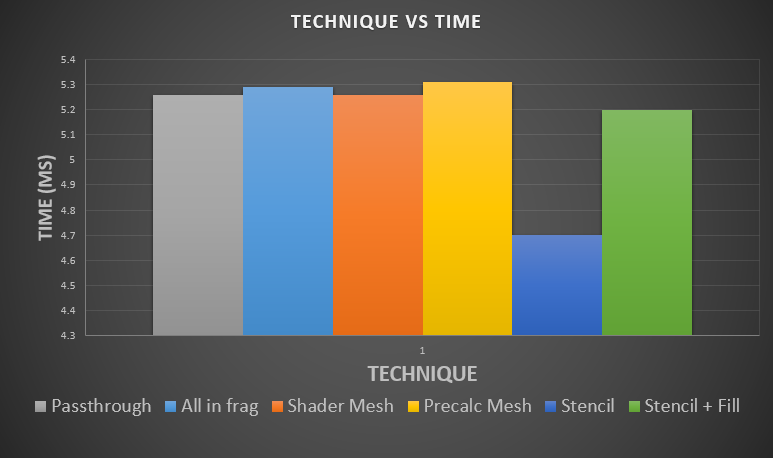

**University of Pennsylvania, CIS 565: GPU Programming and Architecture,
Final Project - Vulkan VR Rendering**

# Barrel Filter and Aberration Methods
* Based on Brown-Conrady Distortion model, but must get constants from HMD vendor
* Option 1. Do it all in frag shader (each fragment is doing the math)
* Option 2. Warp a mesh down in vertex shader and do chormatic aberration in fragment shader(or vertex shader and let the hardware interopolate, Brown-Conrady isn't linear but if the mesh is dense enough it won't matter)
* Option 3. Pre-warp the mesh and pre-calculate all chromatic aberration values up front and pack them into vertex attributes
* All of these were about the same performance (this stage didn't add anything, almost the same as passthrough, about 0.1ms more on a gtx960m)
* A forth option avoids a post process by warping the NDC positions of the drawn meshes in the vertex shader and tesselating them. I belive this requires an art team to make sure this works out for every mesh. 
* see: https://www.imgtec.com/blog/speeding-up-gpu-barrel-distortion-correction-in-mobile-vr/
for reasons why the mesh needs to be dense enough (texture sampling gets funky because of Distortion model's nonlinearity. But if you subdivide enough, things approach linearity)

# Issues with finding inverse Brown-Conrady Distortion
* I relied on the Secant Method for finding the inverse of non-invertable function in order to reverse warp the mesh in optios 2 and 3 above. 
* However, you can run into root jumping issues, which I did but got around by letting the mesh position fall where it may recalculating its UV and finding the source UV from the normal Brown-conrady distortion. It's all pre-baked anyway so it doesnt matter it we take this extra step, just so long as the end result is correct.

# Radial Density Masking
* see https://www.youtube.com/watch?v=DdL3WC_oBO4
* Due to barrel distortion (needed to counteract the pincushioning as the 2D image refracts though the lenses) and hits our eyes, we are over rendering at the edges of the image, by as much as 2x. Barrel distortion squeezes down a 1.4x virtual render target to the device's screen size, pixels in the center get blown out and pixels at the edge get pulled in. See below.
* Radial Density masking uses the stencil to cull 2x2 pixel quads in early-z to avoid rendering them in the fragment shader. 
* The Mask is made by hand in code and uploaded to the stencil once and is used by the forward render pass (VR renderers need forward rendering because MSAA is such a huge win for image fidelity)
* Masking is huge savings, about 20-25% off the top, the issue however is hole filling. Which can put you back where you started, it did for me.

# Adaptive Quality Filtering
* see https://www.youtube.com/watch?v=DdL3WC_oBO4
* Async time warp and space warp are unpleasent experiences for the user, should really only be last resort. If you're using it to maintain frame rate you're creating a really uncomfortable VR experience.
* Use Adaptive quality filtering to detect when user is turning head towards an expensive view. If the last frame time starts go above some target threshold then begin to turn down settings (MSAA and virtual render target scaling (the render target size pre-barrel distortion))
* Can probably avoid async time and space warp altogether.

** Resolution scale 1.5 

** Resolution scale 1.0 

** Resolution scale 0.5 

# Vulkan Performance Things
* To limit context switches (changing shaders, mesh info, etc):
* Sift shader calls into secondary command buffers and combine into one primary so there's only one shader switch for each shader that is needed in the render pass
* use push constants for per draw call dynamic things (model matrix, bit field flags)
* have the UBO use size 2 array for the viewproj of each eye, set the viewport state to dynamic, use push constants to view port switching commands to render in one render pass. (single scene traversal still 2 draw calls)
* multithread your command building (use secondary command buffers), assemble into primary, submit.
* Reduce command buffer count, number of render passes done to build a frame
* Use subpasses when you can, requires 1 to 1 frag sampling from the output of one subpass to the input of another. Good use case would be deferred rendering.

# Data
**Performance of various Barrel/Chromatic Aberration Techniques and Radial Density Mask** 

**Push Constant vs UBO updates** 

**GPU Device Properties** 
https://devblogs.nvidia.com/parallelforall/5-things-you-should-know-about-new-maxwell-gpu-architecture/ 
cuda cores 640 
mem bandwidth 86.4 GB/s 
L2 cache size 2MB 
num banks in shared memory 32 
number of multiprocessor 5 
max blocks per multiprocessor 32 
total shared mem per block 49152 bytes 
total shared mem per MP 65536 bytes 
total regs per block and MP 65536 
max threads per block 1024 
max threads per mp 2048 
total const memory 65536 
max reg per thread 255 
max concurrent warps 64 
total global mem 2G 
 
max dims for block 1024 1024 64 
max dims for a grid 2,147,483,647 65536 65536 
clock rate 1,097,5000 
texture alignment 512 
concurrent copy and execution yes 
major.minor 5.0 
